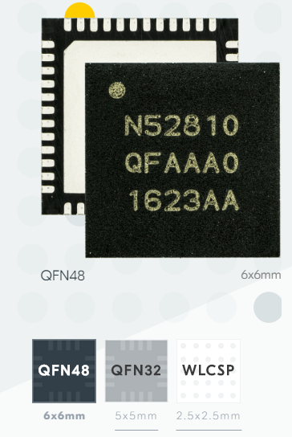
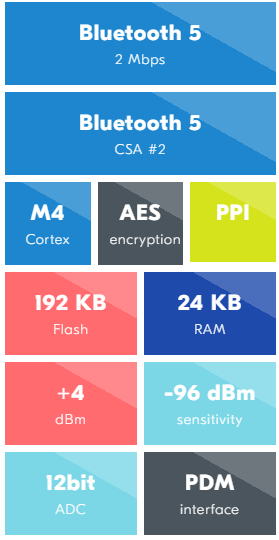

# [nRF52810](https://github.com/sochub/nRF52810) 
 
####  qitas@qitas.cn
#### 归属：[cortex M4](https://github.com/sochub/CM4) 
#### 父级：[nordic](https://github.com/sochub/NRF) 

### [简介](https://github.com/sochub/nRF52810/wiki)

baseline member of the nRF52 Series SoC family. 

- support for Bluetooth 5, ANT and 2.4 GHz proprietary stacks. 

- smallest SoC with its 2.482 x 2.464 mm CSP package.

- ARM® Cortex™-M4 CPU running at 64 MHz. 

 
 

##  [SoC开发平台](http://www.qitas.cn)  

