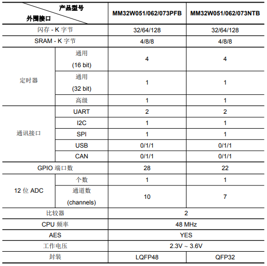

# [MM32W073](https://github.com/SoCXin/MM32W073)

#### [Vendor](https://github.com/SoCXin/Vendor)：[MindMotion](http://www.mindmotion.com.cn/)
#### [Core](https://github.com/SoCXin/Cortex)：[Cortex M0](https://github.com/SoCXin/CM0)
#### [Level](https://github.com/SoCXin/Level)：48MHz

## [描述](https://github.com/SoCXin/MM32W073/wiki)

[MM32W073](https://github.com/SoCXin/MM32W073)具有丰富的功能和通信接口，包括AES/USB/CAN

### 关键特性：

### [资源收录](https://github.com/SoCXin/MM32W073)

* [文档](docs/)
* [资源](src/)

### [选型建议](https://github.com/SoCXin)

* [MM32W051](https://github.com/SoCXin/MM32W051)
* [MM32W073](https://github.com/SoCXin/MM32W073)
* [MM32W373](https://github.com/SoCXin/MM32W373)

###  [SoC芯平台](http://www.SoC.Xin)
